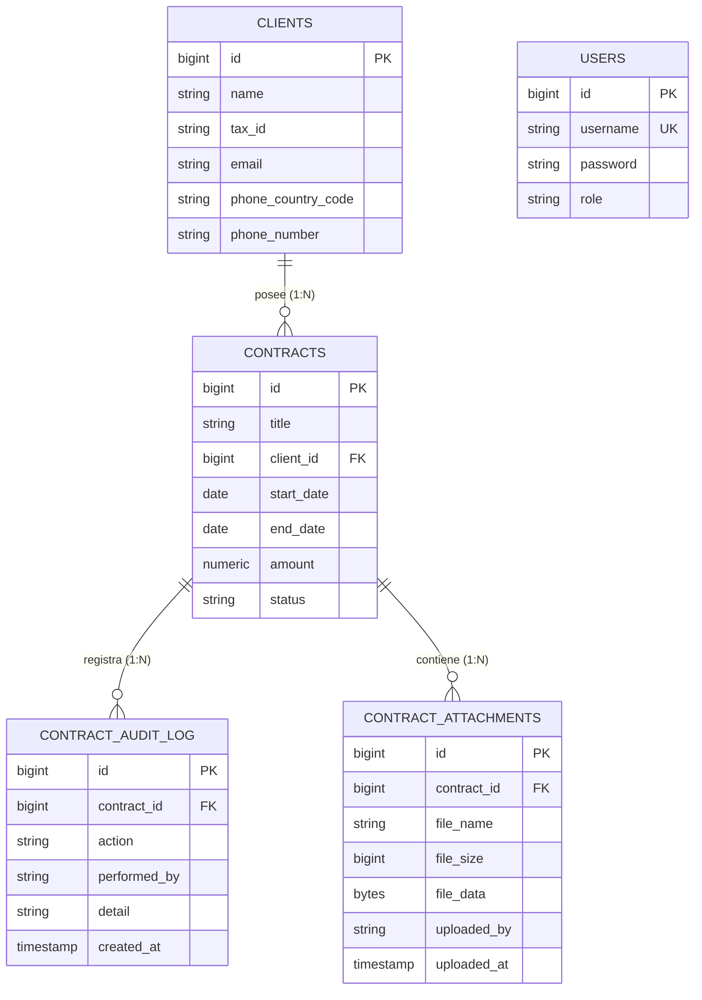

```mermaid

erDiagram
    CLIENTS ||--o{ CONTRACTS : "posee (1:N)"
    CONTRACTS ||--o{ CONTRACT_AUDIT_LOG : "registra (1:N)"
    CONTRACTS ||--o{ CONTRACT_ATTACHMENTS : "contiene (1:N)"

    CLIENTS {
        bigint id PK
        string name
        string tax_id
        string email
        string phone_country_code
        string phone_number
    }

    CONTRACTS {
        bigint id PK
        string title
        bigint client_id FK
        date start_date
        date end_date
        numeric amount
        string status
    }

    USERS {
        bigint id PK
        string username UK
        string password
        string role
    }

    CONTRACT_AUDIT_LOG {
        bigint id PK
        bigint contract_id FK
        string action
        string performed_by
        string detail
        timestamp created_at
    }

    CONTRACT_ATTACHMENTS {
        bigint id PK
        bigint contract_id FK
        string file_name
        bigint file_size
        bytes file_data
        string uploaded_by
        timestamp uploaded_at
    }


```